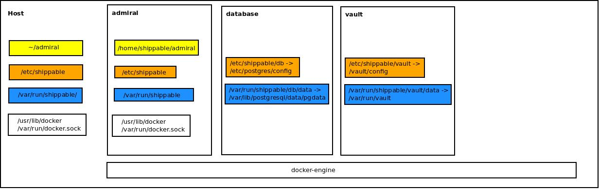

# Admiral - the Shippable installer

## CLI

```
  Usage:
    $./admiral.sh <command> [flags]

  Examples:
    $0 install --help
    $0 install
    $0 install --release v5.2.1     //Install on localhost with 'v5.2.1' release

  Commmands:
    install         Run Shippable installation
    help            Print this message
```

## Mounts

All data and configuration folders are mounted from host inside the containers. The following diagram represents the mounts mapping


